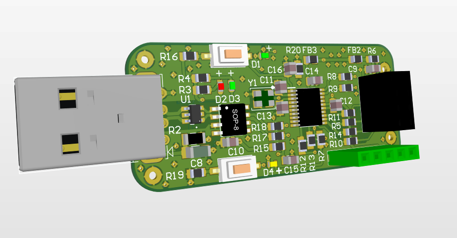
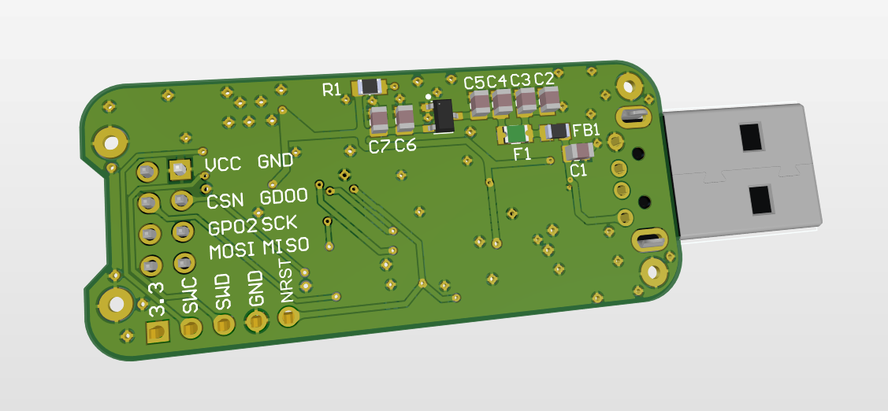
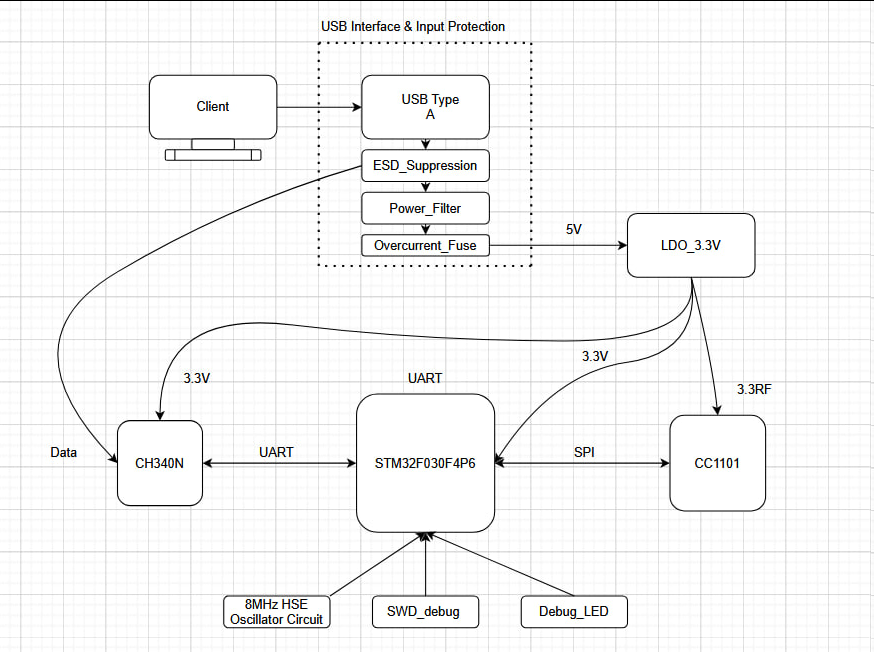
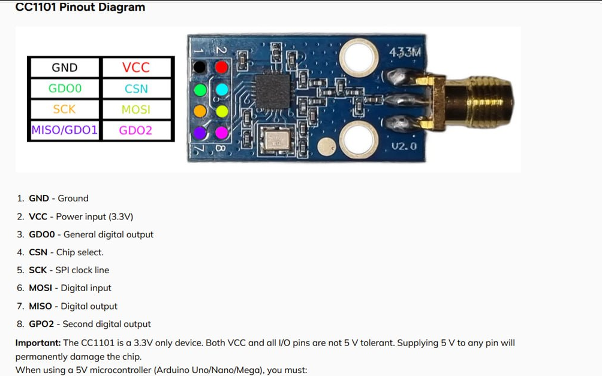
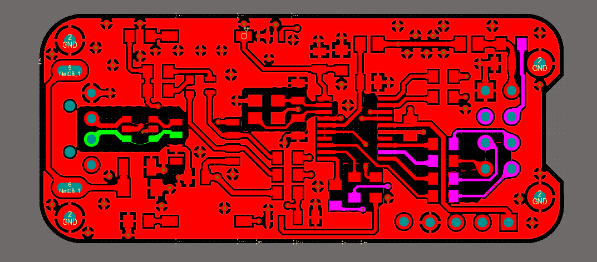
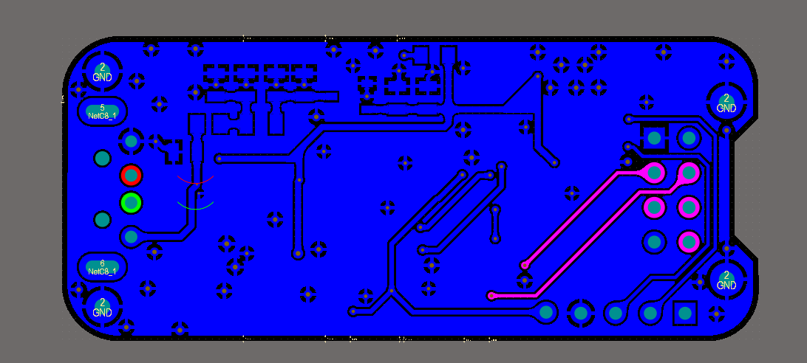
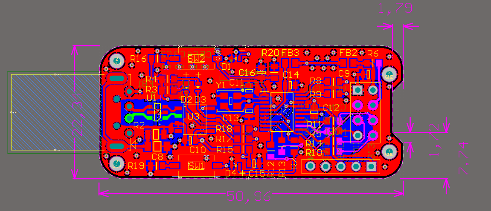

# STM32 CC1101 USB Dongle

Custom USB dongle design featuring **STM32F030F4P6** + **CC1101** RF transceiver + **CH340N** USB-UART bridge.
A complete schematic and PCB design project built in Altium Designer — from component selection to a production-ready layout.

> **Note:** This is a design-stage project — the board has not been manufactured/assembled. The repository showcases the schematic and PCB design process rather than a physical build or firmware implementation.

| Front (3D) | Back (3D) |
|---|---|
|  |  |

---

## Overview

This project is a compact USB dongle designed for interfacing with sub-GHz RF devices via the CC1101 transceiver. The STM32F030F4P6 is intended to handle SPI communication with the CC1101 and expose data to a host PC through a CH340N USB-to-UART bridge.

**Core components:**
| Component | Role |
|---|---|
| STM32F030F4P6 | Main MCU (Cortex-M0), SPI ↔ CC1101 and UART ↔ CH340N |
| CC1101 | Sub-GHz RF transceiver (315/433/868/915 MHz) |
| CH340N | USB-to-UART bridge for host communication |

---

## Block Diagram

The system is structured around three functional zones:

- **USB Interface & Input Protection** — USB Type-A input passes through ESD suppression, power filtering, and an overcurrent fuse before being regulated down to 3.3V by an LDO. This isolates the rest of the board from transients and faults on the USB line.
- **Data path** — CH340N bridges USB data to a UART link with the STM32F030F4P6, which in turn communicates with the CC1101 RF transceiver over SPI.
- **Support circuitry** — an 8 MHz HSE oscillator provides a stable clock reference for the MCU, alongside a dedicated SWD debug header and a debug LED for development and troubleshooting.

---

## RF Module Reference — CC1101

The CC1101 is a sub-GHz RF transceiver operating at **3.3V only** — VCC and all I/O pins are **not 5V tolerant**, which was a key constraint driving the power rail design (dedicated 3.3RF supply, see Block Diagram above).

## Schematic & PCB Design (Altium Designer)

All schematic and PCB design was done in **Altium Designer**.

- **Custom schematic symbol for CC1101** — no ready-made symbol was available in the standard libraries, so the component symbol and footprint were built and verified from the datasheet pinout.
- **Series resistors on SPI and UART lines** — added to dampen reflections and reduce EMI on high-speed digital lines between the MCU, CC1101, and CH340N.
- **USB protection** — a polyfuse (overcurrent protection) combined with a TVS diode (ESD/transient protection) on the USB data and power lines.
- **SWD header** — dedicated programming/debug interface for flashing and debugging via ST-Link.
- **PCB stack-up considerations** — evaluated Core vs. Prepreg material choices and controlled impedance requirements for the RF-adjacent traces near the CC1101.

**Schematic (PDF):**
[📄 docs/schematic.pdf](docs/schematic.pdf)

**PCB layers:**
| Top layer | Bottom layer |
|---|---|
|  |  |

**Board dimensions:**

---

## Programming

The board is designed to be flashed and debugged via **SWD** using an **ST-LINK/V2** programmer.

🔗 [ST-LINK/V2 — official product page (STMicroelectronics)](https://www.st.com/en/development-tools/st-link-v2.html)

---

## Design Challenges & Solutions

Some of the practical considerations addressed during the design process:

- **USB input protection chain** — the USB line goes through ESD suppression, power filtering, and an overcurrent fuse before reaching the LDO. This layered approach was chosen so that transient/ESD events and fault conditions are caught as close to the USB connector as possible, before they can propagate to the 3.3V rail or the rest of the board.
- **Power regulation** — a dedicated LDO_3.3V converts the incoming 5V USB rail to a clean 3.3V supply for the STM32F030F4P6, CH340N, and CC1101, keeping digital and RF supply noise under control. This was also a hard requirement given the CC1101 is 3.3V-only and not 5V tolerant on any pin.
- **Signal integrity on SPI/UART lines** — added series termination resistors to dampen reflections/noise on high-speed digital lines between MCU and peripherals.
- **PCB material selection** — weighed Core vs. Prepreg options for the stack-up, considering controlled impedance requirements for RF-sensitive routing near the CC1101 (3.3RF supply and SPI lines).
- **Clock reference** — an 8 MHz HSE oscillator circuit was added for a stable, accurate clock source to the MCU, rather than relying solely on the internal RC oscillator.
- **Debug/development support** — a dedicated SWD_debug header and a Debug_LED were included on the board to simplify bring-up, flashing, and troubleshooting via ST-Link.

---

## What I'd Improve Next

- **Add test points** on key signal lines (SPI, UART, power rails) to make future debugging and validation easier without probing fine-pitch pins.
- **Formalize impedance calculations** for the RF-adjacent traces near the CC1101, rather than relying on general stack-up guidelines, to have documented confidence in the design.

---

## Skills Demonstrated

- Schematic capture & PCB design in Altium Designer (including custom library parts)
- Signal integrity considerations for high-speed digital and RF-adjacent traces
- USB interface protection design (ESD/overcurrent)
- PCB stack-up and material selection for controlled impedance
- SWD debug interface design

---

## Author

**Levyk** — Telecommunications & Radio Engineering student, Lviv Polytechnic National University
[GitHub](https://github.com/levyyk) ·
